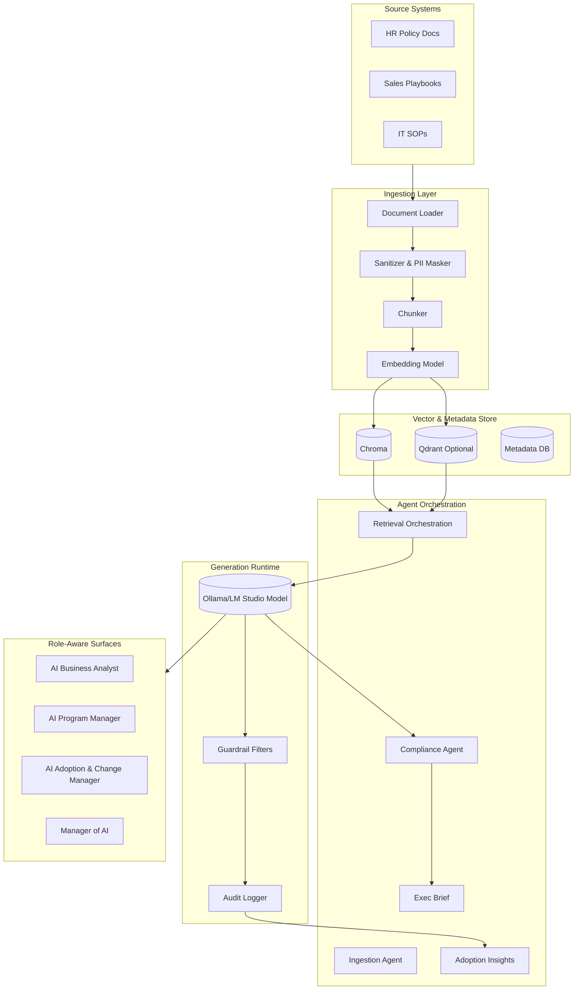

# Architecture

The AI Reading stack keeps computation close to content owners while delivering governed, role-aware answers.

## Component summary
- **Ingestion pipeline** cleans and chunks documents, producing embeddings with local models (e.g., `nomic-embed-text`).
- **Vector store** defaults to Chroma for embedded metadata, with optional Qdrant cluster for sharded, multi-tenant needs. 
- **Offline toolkit** ships with a lightweight JSON vector index for air-gapped validation and unit testing when containerized services are unavailable; swap to Chroma/Qdrant in production deployments.
- **Agents** encapsulate prompt logic and guardrails, orchestrated through local APIs.
- **Runtime** executes retrieval + generation, applying guardrails and logging every decision.

## Trade-offs
| Decision | Option A | Option B | Guidance |
| --- | --- | --- | --- |
| Vector store | **Chroma** (default) | **Qdrant** (optional) | Start with Chroma for single-node simplicity. Move to Qdrant when enterprise-grade filtering, replication, or hybrid search is required. |
| Embedding model | `nomic-embed-text` via Ollama | `text-embedding-3-small` (requires API) | Favor local models to avoid data egress. Use hosted embeddings only if multilingual recall is critical and legal approves. |
| Latency vs quality | Low-latency models (e.g., `mistral:instruct`) | Higher-parameter models (e.g., `llama3:70b`) | SMB deployments often prioritize responsiveness; enterprises may accept slower responses for higher fidelity answers. Offer configurable presets per role. |
| Retrieval depth | Top-3 chunks for speed | Top-6+ chunks for completeness | Monitor answer quality; escalate depth for regulated teams or complex queries even if latency increases. |

## Integration points
- **Identity**: Connect to SSO (Okta, Azure AD) for enterprise RBAC; SMBs can use local account management via the ops scripts.
- **Monitoring**: Stream logs to Loki/Promtail for enterprise observability; SMBs can inspect local JSON logs.
- **Change control**: Hook guardrail outcomes into ticketing systems (Jira/ServiceNow) for escalations when blocks occur.

## Scaling guidance
- Start with a single Compose deployment using GPU-enabled hardware for pilots.
- Add Qdrant + autoscaling Ollama workers for enterprise production.
- Use message queues (e.g., Redis, RabbitMQ) if ingestion concurrency exceeds 100 documents per hour. 

## Production readiness checklist
- **Observability**: forward orchestrator logs to the centralized stack (ELK, Loki) and enable Prometheus scraping on ports `9100` (agents) and `9090` (vector DB health).
- **High availability**: deploy Chroma with filesystem replication for SMB; promote Qdrant with Raft replication across 3 nodes for enterprise uptime guarantees.
- **Disaster recovery**: schedule nightly vector backups to encrypted object storage; test restore quarterly.
- **Configuration management**: manage prompts, guardrails, and settings through GitOps (e.g., Argo CD) so rollbacks are deterministic.
- **Performance baselines**: capture latency histograms per role after each release; compare against success metrics thresholds before cutting over traffic.
